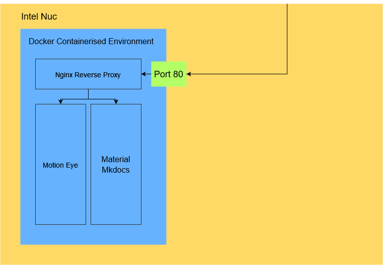

# Network Plan

The network plan for this project is really straight forward, it has open the port 80 which when a request is made on it pipes into Nginx as a reverse proxy whcih is then routed to either Motion Eye or what you should be reading on Material MkDocs.

